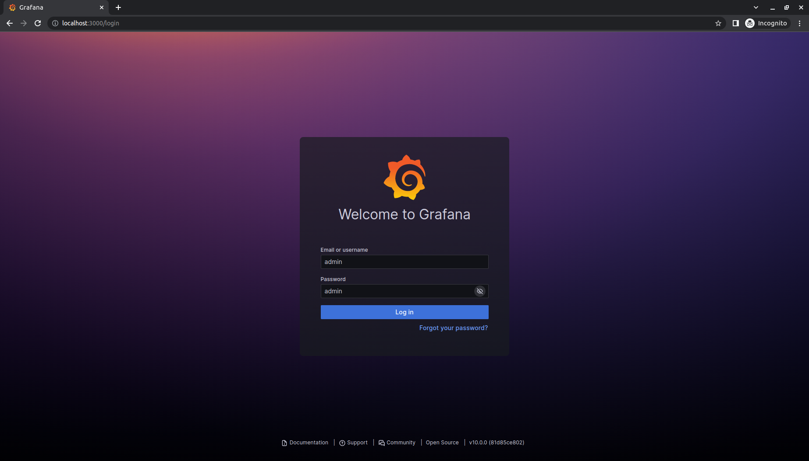
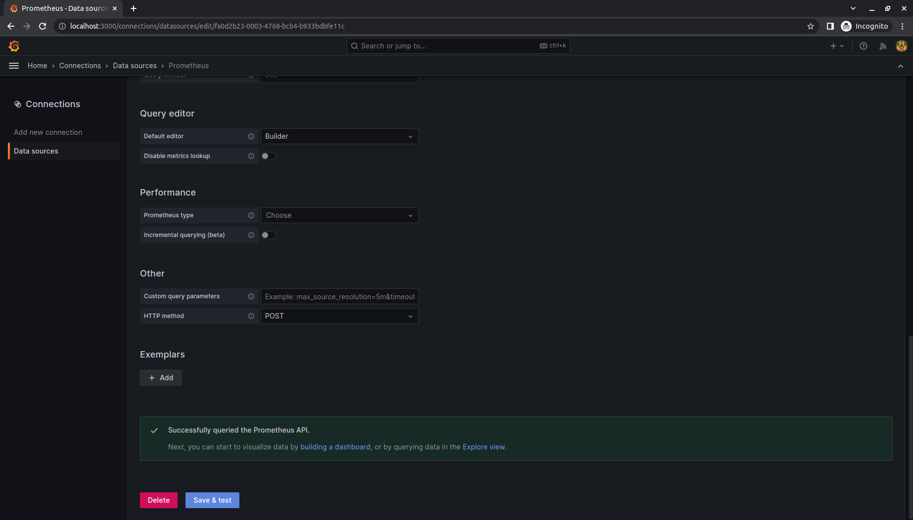
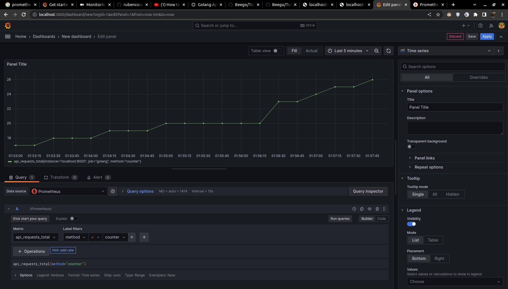
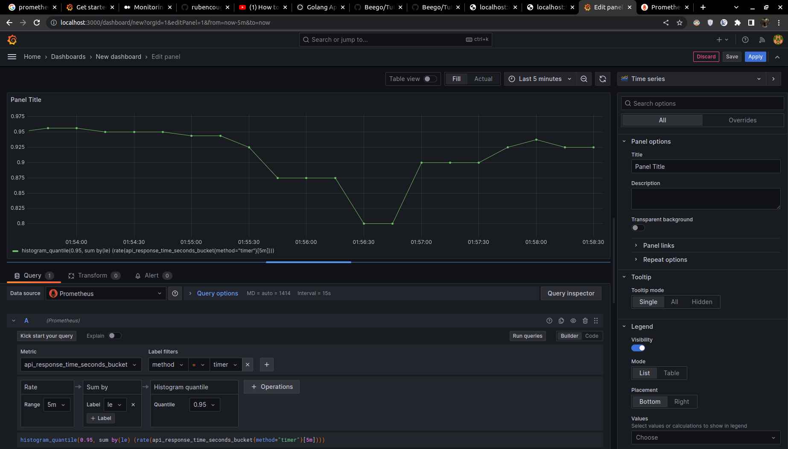

<div dir="rtl">

## آشنایی با Prometheus و Grafana و استفاده از آن در یک Http Server با زبان Go

### فهرست 📝 
- [نویسندگان](#نویسندگان)
- [پیش نیاز ها](#پیش-نیاز-ها)
- [آشنایی با Prometheus](#آشنایی-با-Prometheus)
- [متریک ها (metrics) و برچسب ها (labels)](#متریک-ها-(labels)-و-برچسب-ها-(labels))
- [انواع متریک (metrics types)](#انواع-متریک-(metrics-types))
  - [Counters](#Counters)
  - [Gauges](#Gauges)
  - [Histograms](#Histograms)
  - [Summaries](#Summaries)
- [راه اندازی سرور به زبان go و اضافه کردن متریک به آن](#راه-اندازی-سرور-به-زبان-go-و-اضافه-کردن-متریک-به-آن)
- [داکرایز کردن برنامه](#داکرایز-کردن-برنامه)
- [نمایش متریک ها با استفاده از Grafana](#نمایش-متریک-ها-با-استفاده-از-Grafana)
- [منابع](#منابع)
- [نتیجه گیری](#نتیجه-گیری)

### ✍️نویسندگان

- [احسان رحمانی میاب](https://github.com/Ehsanino82)
- [شایان شعبانی](https://github.com/shayanshabani)
- [امیرمهدی میقانی](https://github.com/amirmm03)

## پیش نیاز ها 
- زبان برنامه نویسی GO

برای نصب آن می توانید از این [وبسایت](https://go.dev/dl/) اقدام کنید.
توجه کنید که حتما Environment Variable مربوط به GOPATH را در کامپیوتر خود تنظیم کنید.

در linux با اجرای دستور زیر:

```bash
export PATH=$PATH:/usr/local/go/bin
```

و در windows با رفتن به تنظیمات Environment Variables و اضافه کردن یک Variable به اسم `GOPATH` و با مقدار `%USERPROFILE%\go`
می توانید این کار را انجام دهید.

- ابزار Docker و Docker Compose

برای نصب Docker می توانید از این [وبسایت](https://docs.docker.com/engine/install/) اقدام کنید.
همچنین برای نصب Docker Compose نیز میتوانید از این [وبسایت](https://docs.docker.com/compose/install/) اقدام کنید.

## آشنایی با Prometheus
<p align=center></p>

پرومتئوس (Prometheus) یکی از انواع ابزارهای مانیتورینگ سرور است که به صورت منبع باز (Open-Source) بوده و داده ها را بر اساس خط زمانی (Time series) آن ها جمع آوری می کند.

ابزار Prometheus در ابتدا در Soundcloud توسعه داده شد اما اکنون توسط بنیاد محاسبات بومی ابری (CNCF) پشتیبانی می شود. این ابزار مانیتورینگ در دهه گذشته به سرعت به شهرت رسید، زیرا ترکیبی از ویژگی های خاص آن که از فضای ابری هم پشتیبانی می کنند، آن را به مجموعه مانتیورینگی ایده آل برای برنامه های امروزی تبدیل کرده است.

## متریک ها (metrics) و برچسب ها(labels)
در Prometheus داده ها یا رویدادها در لحظه ذخیره می شوند. این رویدادها می توانند هر چیز مرتبط با برنامه شما باشند، مانند میزان مصرف حافظه، استفاده از شبکه یا درخواست های ورودی. به واحد داده های جمع آوری شده “متریک (metric)” می گویند.

```go
# Total number of HTTP request
http_requests_total
```

متریک ها نقش مهمی را در درک اینکه چرا برنامه شما به روش خاصی کار می کند بازی می کند. بیایید فرض کنیم که یک برنامه وب را اجرا می کنید و متوجه می شوید که برنامه کند است. برای اینکه بفهمید درون برنامه شما چه اتفاقی می افتد به اطلاعاتی نیاز دارید. به عنوان مثال، زمانی که تعداد درخواست ها زیاد باشد، ممکن است که برنامه کند شود. اگر متریکی برای شمارش درخواست ها را داشته باشید، آنگاه می‌توانید دلیل آن را پیدا کنید و به طور مثال به عنوان یک راه حل، تعداد سرورها را برای مدیریت بار افزایش دهید.

اگر بیش از یک سرویس برای یک متریک خاص دارید، می‌توانید برچسبی (label) اضافه کنید تا مشخص کنید که این متریک از کدام سرویس است. یا در مثالی دیگر، می توانید یک برچسب سرویس به متریک http_requests_total اضافه کنید تا بین درخواست هر سرویس تفاوت قائل شوید:

```go
# Total number of HTTP request
http_requests_total{service="querier"}
```
هنگامی که تعداد زیادی سرویس داریم، استفاده ی درست از label ها به ما این کمک را میکند تا راحت تر بر روی متریک ها کوئری بزنیم.

## انواع متریک (metrics types)
ابزار Prometheus چهار نوع مختلف متریک را ارائه می دهد که هر کدام مزایا و معایب خود را دارند که آنها را برای موارد استفاده مختلف مفید می کند.
### Counters
اولی counter ها که یک نوع متریک ساده هستند که هنگام راه اندازی مجدد سرویس فقط می توان آنها را افزایش داد یا به صفر رساند. counter ها اغلب برای شمارش داده هایی مانند تعداد کل درخواست ها به یک سرویس یا تعداد وظایف تکمیل شده استفاده می شوند. بنابراین اکثر counter ها با استفاده از پسوند _total نامگذاری می شوند. به طور مثال:
```text
# Total number of HTTP request
http_requests_total
```
مقدار ثبت شده توسط counter ها اغلب بی معنا است و اطلاعات زیادی در مورد وضعیت برنامه ها به ما نمی دهد. اطلاعات واقعی را می توان با تکمیل شدن آنها در طول زمان با استفاده از تابع rate() به دست آورد.
### Gauges
دومی gauge ها نیز یک مقدار عددی واحد را نشان می دهند، اما تفاوت آن با counter ها این است که مقدار آن می تواند بالا و پایین برود. بنابراین gauge ها اغلب برای مقادیر اندازه گیری شده مانند دما، رطوبت یا مصرف فعلی حافظه که هم کم و هم زیاد میشوند، استفاده می شوند.

برخلاف counter ‌ها، مقدار فعلی یک gauge معنادار است و می‌تواند مستقیماً در نمودارها استفاده شود.
### Histograms
سومی histogram ها که برای اندازه گیری فراوانی مشاهده ی یک مقدار که در باکت های از پیش تعریف شده خاصی قرار می گیرند استفاده می شود. بدین معنی که آنها اطلاعاتی در مورد توزیع یک متریک مانند مدت زمان پاسخ یک درخواست ارائه می دهند.

به طور پیش فرض Prometheus باکت های زیر را ارائه می دهد:

0.005، 0.01، 0.025، 0.05، 0.075، 0.1، 0.25، 0.5، 0.75، 1، 2.5، 5، 7.5، 10 

این باکت ها برای تمام اندازه گیری ها مناسب نیستند و به راحتی قابل تغییر هستند.
### Summaries
در نهایت آخری summary ها که بسیار شبیه به histogram هستند زیرا هر دو توزیع یک مجموعه داده معین را نشان می دهند. یک تفاوت عمده این است که محاسبات مربوط به histogram در سرور Prometheus انجام می شود در حالی که summary ها در سمت client محاسبه می شوند.
summary ها برای برخی از quantileهای از پیش تعریف‌شده دقیق‌تر هستند، اما به دلیل انجام محاسبات سمت client، می‌توانند منابع بسیار با ارزش تری باشند. به همین دلیل است که برای اکثر موارد استفاده از histogram توصیه می شود.
## راه اندازی سرور به زبان go و اضافه کردن متریک به آن 
در ادامه سعی داریم یک سرور به زبان go بنویسیم و سپس با اضافه کردن متریک به آن عملکرد آن را بررسی کنیم و با استفاده از prometheus آشنا بشیم.

ابتدا به بررسی توابع مربوط به راه اندازی prometheus میپردازیم که در فایل pkg/monitoring/monitor.go قرار دارد. با استفاده از تابع `()StartPrometheusMetricServerOrPanic` سرور مربوط به prometheus را راه می اندازیم.
```golang
func StartPrometheusMetricServerOrPanic(listenAddr string) *http.Server {
  prometheusServer := &http.Server{
    Addr:    listenAddr,
    Handler: promhttp.Handler(),
  }

  go listenAndServePrometheusMetrics(prometheusServer)

  return prometheusServer
}

func listenAndServePrometheusMetrics(server *http.Server) {
  if err := server.ListenAndServe(); err != nil {
    logging.PanicWithError("failed to start prometheus http probe listener", err)
  }
}
```
و در پایان با استفاده از تابع `()ShutdownPrometheusMetricServerOrPanic` به خاموش کردن prometheus server میپردازیم.
```golang
func ShutdownPrometheusMetricServerOrPanic(server *http.Server) {
  if err := server.Shutdown(context.Background()); err != nil {
    logging.PanicWithError("Failed to shutdown prometheus metric server", err)
  }
}
```
در ادامه به بررسی نحوه ی تعریف کردن متریک های مورد نظر میپردازیم. این کار را در metrics/metrics.go انجام میدهیم. برای تعریف کردن متریک مورد نظر باید نوع آن را انتخاب کنیم و سپس ویژگی های مورد نظر آن را ست کنیم. متریک باید با استفاده از بسته prometheus ایجاد شود. متد `()NewHistogramVec` برای ایجاد یک متریک histogram جدید استفاده می شود. البته برای هر متریک همانطور که توضیح داده شد میتوان label نیز تعریف کرد که برای نمونه در اینجا یک label برای متریک های تعریف شده قرار میدهیم. یکی دیگر از متریک های مورد استفاده از نوع counter است که با استفاده از `()NewCounterVec` آن را تعریف میکنیم. در پایان باید متریک هایی را که تعریف کردیم register می کنیم تا prometheus آن متریک را بشناسد.
```golang
package metrics

import (
  "sync"

  "github.com/prometheus/client_golang/prometheus"
)

var (
  ApiResponseTime = prometheus.NewHistogramVec(
    prometheus.HistogramOpts{
      Name: "api_response_time_seconds",
      Help: "Histogram to observe api response time",
    }, []string{"method"},
  )
  ApiTotalRequests = prometheus.NewCounterVec(
    prometheus.CounterOpts{
      Name: "http_requests_total",
      Help: "Number of get requests",
    },
    []string{"method"},
  )
)

var once sync.Once

func InitApiPrometheusMetrics() {
  once.Do(func() {
    prometheus.MustRegister(ApiResponseTime)
    prometheus.MustRegister(ApiTotalRequests)
  })
}


```
در پایان برای راحتی کار در فایل metrics/api/api.go یک استراکت برای هر متریک تعریف میکنیم. نکته ی مهم این است که برای اینکه متریک histogram مورد نظر برای prometheus server ارسال شود باید حتما متود `()Observe` بر روی متریک صدا زده شود. تابع `StopWithMethod()` در حقیقت با استفاده از زمان اولیه متریک مورد نظر را با label ی که برای آن تعریف کردیم، observe میکند.
```golang
package api

import (
  "prometheus-go/metrics"
  "time"

  "github.com/prometheus/client_golang/prometheus"
)

type Api interface {
  StopWithError(error)
}

type ResponseTime struct {
  metric    *prometheus.HistogramVec
  startTime time.Time
}

func NewApiTimer() *ResponseTime {
  return &ResponseTime{
    metric:    metrics.ApiResponseTime,
    startTime: time.Now(),
  }
}

func (r *ResponseTime) StopWithMethod(method string) {
  labels := prometheus.Labels{"method": method}

  r.metric.With(labels).Observe(time.Since(r.startTime).Seconds())
}
```
پس از بررسی توابع مربوط به prometheus اکنون کافیست که http server خود را راه اندازی کنیم و متریک های دلخواه را درون آن قرار دهیم. در این تحقیق با استفاده از فریم ورک gin یک http server بر روی پورت 8080 راه می اندازیم و سعی میکنیم آن را مانیتور کنیم. همچنین port مربوط به سرور prometheus نیز 9000 است.
برای بررسی تعداد درخواست های دریافت شده از متریک از نوع counter که پیشتر تعریف کردیم استفاده میکنیم و کافی است با دریافت هر رکوئست با صدا زدن تابع `()Inc` مقدار آن را یک واحد افزایش دهیم. همچنین برای متریک از نوع histogram نیز ابتدا `()NewApiTimer` را صدا میزنیم تا تایم استارت بررسی درخواست کاربر ست شود و در نهایت پس از پایان کار تابع متریک مورد نظر را Stop میکنیم که پیشتر عملکرد این تابع را دیدیم. این کار را با `defer apiTimer.StopWithMethod("timer")` انجام میدهیم که در حقیقت پس از پایان تابع اصلی، تابع `()StopWithMethod` را صدا بزند.
```golang
package main

import (
  "github.com/gin-gonic/gin"
  "math/rand"
  "net/http"
  "prometheus-go/metrics"
  "prometheus-go/metrics/api"
  "prometheus-go/pkg/monitoring"
  "strconv"
  "time"
)

const listenAddr = ":9000"

func main() {
  metrics.InitApiPrometheusMetrics()
  prometheusMetricServer := monitoring.StartPrometheusMetricServerOrPanic(listenAddr)
  defer monitoring.ShutdownPrometheusMetricServerOrPanic(prometheusMetricServer)

  r := gin.Default()
  r.GET("/", func(c *gin.Context) {
    metrics.ApiTotalRequests.WithLabelValues("counter").Inc()
    apiTimer := api.NewApiTimer()
    defer apiTimer.StopWithMethod("timer")
    t := rand.Intn(1000) + 1
    time.Sleep(time.Duration(t) * time.Millisecond)
    c.JSON(http.StatusOK, gin.H{
      "message": "count up",
    })
  })

  r.Run()
}
```
اکنون با اجرای برنامه، http server یر روی پورت 8080 به کار می افتد. همزمان prometheus server نیز بر روی پورت 9000 در حال اجرا است و متریک های ما بر روی آن ارسال میشود. با رفتن به صفحه ی localhost:9000 با response زیر روبه رو میشویم.
```go
# HELP go_gc_duration_seconds A summary of the pause duration of garbage collection cycles.
# TYPE go_gc_duration_seconds summary
go_gc_duration_seconds{quantile="0"} 3.0854e-05
go_gc_duration_seconds{quantile="0.25"} 3.0854e-05
go_gc_duration_seconds{quantile="0.5"} 3.0854e-05
go_gc_duration_seconds{quantile="0.75"} 3.0854e-05
go_gc_duration_seconds{quantile="1"} 3.0854e-05
go_gc_duration_seconds_sum 3.0854e-05
go_gc_duration_seconds_count 1
# HELP go_goroutines Number of goroutines that currently exist.
# TYPE go_goroutines gauge
go_goroutines 7
# HELP go_info Information about the Go environment.
# TYPE go_info gauge
go_info{version="go1.20.5"} 1
# HELP go_memstats_alloc_bytes Number of bytes allocated and still in use.
# TYPE go_memstats_alloc_bytes gauge
go_memstats_alloc_bytes 1.729976e+06
# HELP go_memstats_alloc_bytes_total Total number of bytes allocated, even if freed.
# TYPE go_memstats_alloc_bytes_total counter
go_memstats_alloc_bytes_total 3.24024e+06
# HELP go_memstats_buck_hash_sys_bytes Number of bytes used by the profiling bucket hash table.
# TYPE go_memstats_buck_hash_sys_bytes gauge
go_memstats_buck_hash_sys_bytes 4788
# HELP go_memstats_frees_total Total number of frees.
# TYPE go_memstats_frees_total counter
go_memstats_frees_total 15758
# HELP go_memstats_gc_sys_bytes Number of bytes used for garbage collection system metadata.
# TYPE go_memstats_gc_sys_bytes gauge
go_memstats_gc_sys_bytes 7.57004e+06
# HELP go_memstats_heap_alloc_bytes Number of heap bytes allocated and still in use.
# TYPE go_memstats_heap_alloc_bytes gauge
go_memstats_heap_alloc_bytes 1.729976e+06
# HELP go_memstats_heap_idle_bytes Number of heap bytes waiting to be used.
# TYPE go_memstats_heap_idle_bytes gauge
go_memstats_heap_idle_bytes 3.833856e+06
# HELP go_memstats_heap_inuse_bytes Number of heap bytes that are in use.
# TYPE go_memstats_heap_inuse_bytes gauge
go_memstats_heap_inuse_bytes 3.964928e+06
# HELP go_memstats_heap_objects Number of allocated objects.
# TYPE go_memstats_heap_objects gauge
go_memstats_heap_objects 9180
# HELP go_memstats_heap_released_bytes Number of heap bytes released to OS.
# TYPE go_memstats_heap_released_bytes gauge
go_memstats_heap_released_bytes 2.818048e+06
# HELP go_memstats_heap_sys_bytes Number of heap bytes obtained from system.
# TYPE go_memstats_heap_sys_bytes gauge
go_memstats_heap_sys_bytes 7.798784e+06
# HELP go_memstats_last_gc_time_seconds Number of seconds since 1970 of last garbage collection.
# TYPE go_memstats_last_gc_time_seconds gauge
go_memstats_last_gc_time_seconds 1.687201238835806e+09
# HELP go_memstats_lookups_total Total number of pointer lookups.
# TYPE go_memstats_lookups_total counter
go_memstats_lookups_total 0
# HELP go_memstats_mallocs_total Total number of mallocs.
# TYPE go_memstats_mallocs_total counter
go_memstats_mallocs_total 24938
# HELP go_memstats_mcache_inuse_bytes Number of bytes in use by mcache structures.
# TYPE go_memstats_mcache_inuse_bytes gauge
go_memstats_mcache_inuse_bytes 9600
# HELP go_memstats_mcache_sys_bytes Number of bytes used for mcache structures obtained from system.
# TYPE go_memstats_mcache_sys_bytes gauge
go_memstats_mcache_sys_bytes 15600
# HELP go_memstats_mspan_inuse_bytes Number of bytes in use by mspan structures.
# TYPE go_memstats_mspan_inuse_bytes gauge
go_memstats_mspan_inuse_bytes 127200
# HELP go_memstats_mspan_sys_bytes Number of bytes used for mspan structures obtained from system.
# TYPE go_memstats_mspan_sys_bytes gauge
go_memstats_mspan_sys_bytes 130560
# HELP go_memstats_next_gc_bytes Number of heap bytes when next garbage collection will take place.
# TYPE go_memstats_next_gc_bytes gauge
go_memstats_next_gc_bytes 4.194304e+06
# HELP go_memstats_other_sys_bytes Number of bytes used for other system allocations.
# TYPE go_memstats_other_sys_bytes gauge
go_memstats_other_sys_bytes 1.649652e+06
# HELP go_memstats_stack_inuse_bytes Number of bytes in use by the stack allocator.
# TYPE go_memstats_stack_inuse_bytes gauge
go_memstats_stack_inuse_bytes 589824
# HELP go_memstats_stack_sys_bytes Number of bytes obtained from system for stack allocator.
# TYPE go_memstats_stack_sys_bytes gauge
go_memstats_stack_sys_bytes 589824
# HELP go_memstats_sys_bytes Number of bytes obtained from system.
# TYPE go_memstats_sys_bytes gauge
go_memstats_sys_bytes 1.7759248e+07
# HELP go_threads Number of OS threads created.
# TYPE go_threads gauge
go_threads 11
# HELP process_cpu_seconds_total Total user and system CPU time spent in seconds.
# TYPE process_cpu_seconds_total counter
process_cpu_seconds_total 0.16
# HELP process_max_fds Maximum number of open file descriptors.
# TYPE process_max_fds gauge
process_max_fds 1.048576e+06
# HELP process_open_fds Number of open file descriptors.
# TYPE process_open_fds gauge
process_open_fds 10
# HELP process_resident_memory_bytes Resident memory size in bytes.
# TYPE process_resident_memory_bytes gauge
process_resident_memory_bytes 1.54624e+07
# HELP process_start_time_seconds Start time of the process since unix epoch in seconds.
# TYPE process_start_time_seconds gauge
process_start_time_seconds 1.68720123807e+09
# HELP process_virtual_memory_bytes Virtual memory size in bytes.
# TYPE process_virtual_memory_bytes gauge
process_virtual_memory_bytes 1.422999552e+09
# HELP process_virtual_memory_max_bytes Maximum amount of virtual memory available in bytes.
# TYPE process_virtual_memory_max_bytes gauge
process_virtual_memory_max_bytes 1.8446744073709552e+19
# HELP promhttp_metric_handler_requests_in_flight Current number of scrapes being served.
# TYPE promhttp_metric_handler_requests_in_flight gauge
promhttp_metric_handler_requests_in_flight 1
# HELP promhttp_metric_handler_requests_total Total number of scrapes by HTTP status code.
# TYPE promhttp_metric_handler_requests_total counter
promhttp_metric_handler_requests_total{code="200"} 0
promhttp_metric_handler_requests_total{code="500"} 0
promhttp_metric_handler_requests_total{code="503"} 0
```
توجه کنید که متریک های بالا از پیش تعریف شده هستند و اغلب سطح پایین سرویس را مورد بررسی قرار میدهند اما غالبا نیاز داریم تا متریک های خودمان را تعریف کنیم تا ارتباط بهتری با عملکرد سرویس برقرار کنیم که این کار را انجام دادیم.
اکنون اگر چندین ریکوئست به localhost:8000 ارسال کنیم، آنگاه با رفرش کردن پورت 9000 با پاسخ زیر مواجه میشویم.
```go
# HELP api_requests_total Number of get requests
# TYPE api_requests_total counter
api_requests_total{method="counter"} 16
# HELP api_response_time_seconds Histogram to observe api response time
# TYPE api_response_time_seconds histogram
api_response_time_seconds_bucket{method="timer",le="0.005"} 0
api_response_time_seconds_bucket{method="timer",le="0.01"} 0
api_response_time_seconds_bucket{method="timer",le="0.025"} 0
api_response_time_seconds_bucket{method="timer",le="0.05"} 0
api_response_time_seconds_bucket{method="timer",le="0.1"} 1
api_response_time_seconds_bucket{method="timer",le="0.25"} 3
api_response_time_seconds_bucket{method="timer",le="0.5"} 7
api_response_time_seconds_bucket{method="timer",le="1"} 16
api_response_time_seconds_bucket{method="timer",le="2.5"} 16
api_response_time_seconds_bucket{method="timer",le="5"} 16
api_response_time_seconds_bucket{method="timer",le="10"} 16
api_response_time_seconds_bucket{method="timer",le="+Inf"} 16
api_response_time_seconds_sum{method="timer"} 8.830875888000001
api_response_time_seconds_count{method="timer"} 16
# HELP go_gc_duration_seconds A summary of the pause duration of garbage collection cycles.
# TYPE go_gc_duration_seconds summary
go_gc_duration_seconds{quantile="0"} 7.4097e-05
go_gc_duration_seconds{quantile="0.25"} 7.4097e-05
go_gc_duration_seconds{quantile="0.5"} 7.4097e-05
go_gc_duration_seconds{quantile="0.75"} 7.4097e-05
go_gc_duration_seconds{quantile="1"} 7.4097e-05
go_gc_duration_seconds_sum 7.4097e-05
go_gc_duration_seconds_count 1
# HELP go_goroutines Number of goroutines that currently exist.
# TYPE go_goroutines gauge
go_goroutines 8
# HELP go_info Information about the Go environment.
# TYPE go_info gauge
go_info{version="go1.20.5"} 1
# HELP go_memstats_alloc_bytes Number of bytes allocated and still in use.
# TYPE go_memstats_alloc_bytes gauge
go_memstats_alloc_bytes 1.77296e+06
# HELP go_memstats_alloc_bytes_total Total number of bytes allocated, even if freed.
# TYPE go_memstats_alloc_bytes_total counter
go_memstats_alloc_bytes_total 3.284688e+06
# HELP go_memstats_buck_hash_sys_bytes Number of bytes used by the profiling bucket hash table.
# TYPE go_memstats_buck_hash_sys_bytes gauge
go_memstats_buck_hash_sys_bytes 4788
# HELP go_memstats_frees_total Total number of frees.
# TYPE go_memstats_frees_total counter
go_memstats_frees_total 15766
# HELP go_memstats_gc_sys_bytes Number of bytes used for garbage collection system metadata.
# TYPE go_memstats_gc_sys_bytes gauge
go_memstats_gc_sys_bytes 7.607048e+06
# HELP go_memstats_heap_alloc_bytes Number of heap bytes allocated and still in use.
# TYPE go_memstats_heap_alloc_bytes gauge
go_memstats_heap_alloc_bytes 1.77296e+06
# HELP go_memstats_heap_idle_bytes Number of heap bytes waiting to be used.
# TYPE go_memstats_heap_idle_bytes gauge
go_memstats_heap_idle_bytes 3.506176e+06
# HELP go_memstats_heap_inuse_bytes Number of heap bytes that are in use.
# TYPE go_memstats_heap_inuse_bytes gauge
go_memstats_heap_inuse_bytes 4.227072e+06
# HELP go_memstats_heap_objects Number of allocated objects.
# TYPE go_memstats_heap_objects gauge
go_memstats_heap_objects 9286
# HELP go_memstats_heap_released_bytes Number of heap bytes released to OS.
# TYPE go_memstats_heap_released_bytes gauge
go_memstats_heap_released_bytes 2.596864e+06
# HELP go_memstats_heap_sys_bytes Number of heap bytes obtained from system.
# TYPE go_memstats_heap_sys_bytes gauge
go_memstats_heap_sys_bytes 7.733248e+06
# HELP go_memstats_last_gc_time_seconds Number of seconds since 1970 of last garbage collection.
# TYPE go_memstats_last_gc_time_seconds gauge
go_memstats_last_gc_time_seconds 1.6872015261422524e+09
# HELP go_memstats_lookups_total Total number of pointer lookups.
# TYPE go_memstats_lookups_total counter
go_memstats_lookups_total 0
# HELP go_memstats_mallocs_total Total number of mallocs.
# TYPE go_memstats_mallocs_total counter
go_memstats_mallocs_total 25052
# HELP go_memstats_mcache_inuse_bytes Number of bytes in use by mcache structures.
# TYPE go_memstats_mcache_inuse_bytes gauge
go_memstats_mcache_inuse_bytes 9600
# HELP go_memstats_mcache_sys_bytes Number of bytes used for mcache structures obtained from system.
# TYPE go_memstats_mcache_sys_bytes gauge
go_memstats_mcache_sys_bytes 15600
# HELP go_memstats_mspan_inuse_bytes Number of bytes in use by mspan structures.
# TYPE go_memstats_mspan_inuse_bytes gauge
go_memstats_mspan_inuse_bytes 106720
# HELP go_memstats_mspan_sys_bytes Number of bytes used for mspan structures obtained from system.
# TYPE go_memstats_mspan_sys_bytes gauge
go_memstats_mspan_sys_bytes 114240
# HELP go_memstats_next_gc_bytes Number of heap bytes when next garbage collection will take place.
# TYPE go_memstats_next_gc_bytes gauge
go_memstats_next_gc_bytes 4.194304e+06
# HELP go_memstats_other_sys_bytes Number of bytes used for other system allocations.
# TYPE go_memstats_other_sys_bytes gauge
go_memstats_other_sys_bytes 1.36682e+06
# HELP go_memstats_stack_inuse_bytes Number of bytes in use by the stack allocator.
# TYPE go_memstats_stack_inuse_bytes gauge
go_memstats_stack_inuse_bytes 655360
# HELP go_memstats_stack_sys_bytes Number of bytes obtained from system for stack allocator.
# TYPE go_memstats_stack_sys_bytes gauge
go_memstats_stack_sys_bytes 655360
# HELP go_memstats_sys_bytes Number of bytes obtained from system.
# TYPE go_memstats_sys_bytes gauge
go_memstats_sys_bytes 1.7497104e+07
# HELP go_threads Number of OS threads created.
# TYPE go_threads gauge
go_threads 12
# HELP process_cpu_seconds_total Total user and system CPU time spent in seconds.
# TYPE process_cpu_seconds_total counter
process_cpu_seconds_total 0.2
# HELP process_max_fds Maximum number of open file descriptors.
# TYPE process_max_fds gauge
process_max_fds 1.048576e+06
# HELP process_open_fds Number of open file descriptors.
# TYPE process_open_fds gauge
process_open_fds 11
# HELP process_resident_memory_bytes Resident memory size in bytes.
# TYPE process_resident_memory_bytes gauge
process_resident_memory_bytes 1.5896576e+07
# HELP process_start_time_seconds Start time of the process since unix epoch in seconds.
# TYPE process_start_time_seconds gauge
process_start_time_seconds 1.68720152535e+09
# HELP process_virtual_memory_bytes Virtual memory size in bytes.
# TYPE process_virtual_memory_bytes gauge
process_virtual_memory_bytes 1.498238976e+09
# HELP process_virtual_memory_max_bytes Maximum amount of virtual memory available in bytes.
# TYPE process_virtual_memory_max_bytes gauge
process_virtual_memory_max_bytes 1.8446744073709552e+19
# HELP promhttp_metric_handler_requests_in_flight Current number of scrapes being served.
# TYPE promhttp_metric_handler_requests_in_flight gauge
promhttp_metric_handler_requests_in_flight 1
# HELP promhttp_metric_handler_requests_total Total number of scrapes by HTTP status code.
# TYPE promhttp_metric_handler_requests_total counter
promhttp_metric_handler_requests_total{code="200"} 0
promhttp_metric_handler_requests_total{code="500"} 0
promhttp_metric_handler_requests_total{code="503"} 0
```
همانظور که مشاهده میشود، متریک های اضافه شده را اکنون میبینیم. برای متریک histogram مشاهده میکنیم که برای هر باکت، متریک مورد نظر را داریم. همچنین یکی از ویژگی های histogramvec این است که با استفاده از `api_response_time_seconds_count` عملا میتوانیم تعداد کل درخواست ها را ببینیم.(در این تحقیق متریک counter را به این علت اضافه کردیم که با کار با آن آشنا شویم)

## داکرایز کردن برنامه
در این مرحله قصد داریم تا با استفاده از داکرایز کردن برنامه، اجرای آن را راحت تر کنیم و در ادامه نیز با افزودن سرویس grafana میتوانیم به صورت گراف، متریک های خود را ببینیم.
ابتدا یک داکرفایل برای برنامه ی خود مینویسیم که dependency های مورد نیاز را دانلود میکند و در نهایت از برنامه ی ما build میگیرد و آن را اجرا میکند.

```dockerfile
FROM golang:alpine AS build

RUN apk --update add ca-certificates git

WORKDIR /srv/build

COPY go.mod .
COPY go.sum .
COPY cmd/main.go .
COPY metrics ./metrics
COPY pkg ./pkg

RUN go mod download
RUN CGO_ENABLED=0 GOOS=linux go build -a -installsuffix cgo -ldflags '-extldflags "-static"' -o main .

EXPOSE 9000
EXPOSE 8080

FROM golang:alpine AS runtime

WORKDIR /srv/app

COPY --from=build /srv/build/main /bin/

CMD ["/bin/main"]
```
اکنون یک فایل برای کانفیگ کردن prometheus مینویسیم. در این فایل مشخص میکنیم که سرور prometheus باید اطلاعات مربوط به چه صفحه ای را scrape کند. (در برنامه ی ما localhost:9000/prometheus)
```yaml
global:
  scrape_interval:     15s
  evaluation_interval: 15s

scrape_configs:
  - job_name: prometheus
    static_configs:
      - targets: ['localhost:9090']
  - job_name: golang
    metrics_path: /prometheus
    static_configs:
      - targets: ['localhost:9000']
```
در نهایت اکنون کافی است فایل docker compose مطلوب برای بیلد کردن و بالا آوردن سرویس ها بنویسیم که به شکل زیر است:
```yaml
version: '3.1'

services:
  golang:
    build:
      context: ./
      dockerfile: Dockerfile
    container_name: golang
    restart: always
    ports:
      - '9000:9000'
      - '8080:8080'
    network_mode: host
  prometheus:
    image: prom/prometheus:v2.24.0
    volumes:
      - ./prometheus/:/etc/prometheus/
      - prometheus_data:/prometheus
    command:
      - '--config.file=/etc/prometheus/prometheus.yml'
      - '--storage.tsdb.path=/prometheus'
      - '--web.console.libraries=/usr/share/prometheus/console_libraries'
      - '--web.console.templates=/usr/share/prometheus/consoles'
    ports:
      - 9090:9090
    restart: always
    network_mode: host

volumes:
  prometheus_data:
```
در نهایت میتوانیم با استفاده از `docker compose up -d` کانتینر های خود را بالا بیاوریم.
## نمایش متریک ها با استفاده از Grafana
<p align=center></p>

برای استفاده از grafana ابتدا باید کانتینر مربوط به آن را وارد docker compose بکنیم که بدین منظور کافیست فایل docker compose را به شکل زیر آپدیت کنیم:
```yaml
version: '3.1'

services:
  grafana:
    image: grafana/grafana:latest
    container_name: grafana
    ports:
      - "3000:3000"
    volumes:
      - grafana-storage:/var/lib/grafana
    network_mode: host
  golang:
    build:
      context: ./
      dockerfile: Dockerfile
    container_name: golang
    restart: always
    ports:
      - '9000:9000'
      - '8080:8080'
    network_mode: host
  prometheus:
    image: prom/prometheus:v2.24.0
    volumes:
      - ./prometheus/:/etc/prometheus/
      - prometheus_data:/prometheus
    command:
      - '--config.file=/etc/prometheus/prometheus.yml'
      - '--storage.tsdb.path=/prometheus'
      - '--web.console.libraries=/usr/share/prometheus/console_libraries'
      - '--web.console.templates=/usr/share/prometheus/consoles'
    ports:
      - 9090:9090
    restart: always
    network_mode: host

volumes:
  grafana-storage:
  prometheus_data:
```
اکنون مجددا با استفاده از دستور `docker compose up -d` میتوانیم کانتینرها را بالا بیاوریم که کانتینر مریوط به grafana نیز بالا می آید. برای دسترسی به پنل گرافانا کافیست به آدرس `localhost:3000` بروید. برای ورود از ما username و password خواسته میشود که هردوی آنها عبارت admin هستند.
<p align=center></p>

پس از login کردن، ابتدا باید دیتاسورس مربوطه را به گرافانا بدهیم که برای این کار میتوانیم به configuration/data source برویم و دیتاسورس مورد نظر را اضافه کنیم. در این برنامه prometheus server مورد نظر برروی آدرس `localhost:9090` در حال اجرا است بنابراین این آدرس را در بخش url قرار میدهیم و گزینه save & test را میزنیم.
<p align=center></p>
<p align=center></p>

سپس یک panel جدید باز میکنیم و با انتخاب کردن متریک مورد نظر و ایجاد کوئری مناسب، گراف متریک مورد نظر را مشاهده میکنیم.
<p align=center></p>
<p align=center></p>

## منابع
- https://prometheus.io/docs
- https://grafana.com/docs/
- https://www.youtube.com/watch?v=pP2DKCKR4CQ
## نتیجه گیری
در این تحقیق سعی کردیم تا با ارائه ای قدم به قدم از راه اندازی prometheus و تعریف متریک های مورد نظر خودمان و در نهایت نمایش گرافیکی آن با کمک grafana همراه شویم.